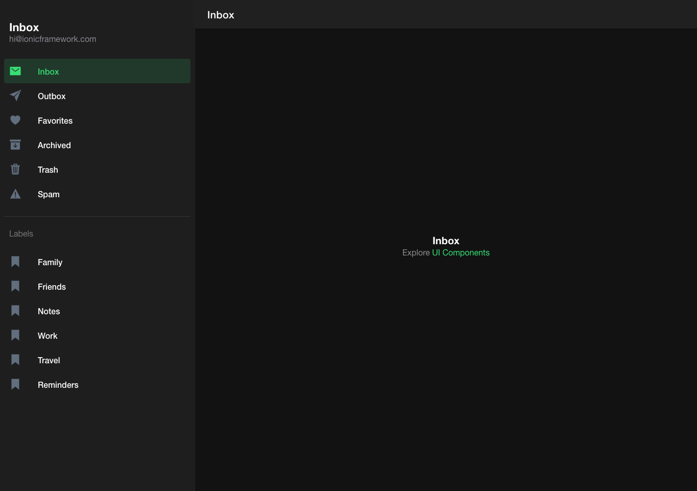
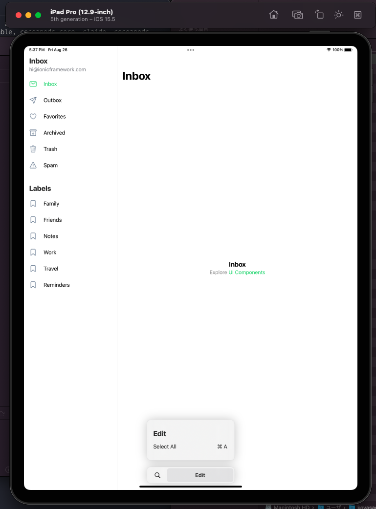

# STUDY.IONIC.TODOAPP

- Ionic とは
  - モバイル、デスクトップアプリを作るフレームワーク
  - Web 技術を利用する
  - Web Components が使われている
  - Angular, React, Vue などを利用できる
  - オリジナルの UI コンポーネントを持っている
  - ルーティング機能もある
  - ページ遷移時のアニメーションもある
  - カメラなどのネイティブ機能にもアクセスできる
- 特徴
  - UI コンポーネントが揃っている
    - iOS, Android を気にしなくて良い
  - 軽量で高速である
    - 本には色々比較が書いてある
    - 今回は特に気にしないでいく
  - モバイルライクな URL ルーティング
    - 非線形ナビゲーション、ナビゲーションスタックを使っている
  - モバイルアプリに変換する機能の標準装備
  - セマンティックバージョニングの採用

## 作業ログ

- Node のバージョンを確認する。v12 以上であればよさそう。

```bash
node -v

v18.7.0
```

- ionic をインストールする。
- 以下の警告が出ている
  - `formidiable@1.2.6` の deprecated 警告
  - `uuid@3.4.0` の deprecated 警告
  - `superagent@4.1.0` の deprecated 警告
  - `ionic@5.4.16` の deprecated 警告
- ionic の CLI は `@ionic/cli` にパッケージ名が変わったらしい。
- twitter を見ろ、とあるので確認してみる。

```bash
npm i -g ionic

npm WARN deprecated formidable@1.2.6: Please upgrade to latest, formidable@v2 or formidable@v3! Check these notes: https://bit.ly/2ZEqIau
npm WARN deprecated uuid@3.4.0: Please upgrade  to version 7 or higher.  Older versions may use Math.random() in certain circumstances, which is known to be problematic.  See https://v8.dev/blog/math-random for details.
npm WARN deprecated superagent@4.1.0: Please upgrade to v7.0.2+ of superagent.  We have fixed numerous issues with streams, form-data, attach(), filesystem errors not bubbling up (ENOENT on attach()), and all tests are now passing.  See the releases tab for more information at <https://github.com/visionmedia/superagent/releases>.
npm WARN deprecated ionic@5.4.16: The Ionic CLI now uses ✨ @ionic/cli ✨ for its package name! 👉 https://twitter.com/ionicframework/status/1223268498362851330

added 233 packages, and audited 234 packages in 12s

21 packages are looking for funding
  run `npm fund` for details

6 vulnerabilities (1 moderate, 4 high, 1 critical)

To address all issues possible (including breaking changes), run:
  npm audit fix --force

Some issues need review, and may require choosing
a different dependency.

Run `npm audit` for details.
```

- `ionic` はアンインストールする

```bash
npm uninstall -g ionic
```

- `@ionic/cli` をインストールする
- 以下の警告が出ている
  - `formidable@1.2.6` の deprecated 警告
  - `superagent@5.3.1` の deprecated 警告
- 今回は上記警告は無視する

```bash
npm i -g @ionic/cli

npm WARN deprecated formidable@1.2.6: Please upgrade to latest, formidable@v2 or formidable@v3! Check these notes: https://bit.ly/2ZEqIau
npm WARN deprecated superagent@5.3.1: Please upgrade to v7.0.2+ of superagent.  We have fixed numerous issues with streams, form-data, attach(), filesystem errors not bubbling up (ENOENT on attach()), and all tests are now passing.  See the releases tab for more information at <https://github.com/visionmedia/superagent/releases>.

added 218 packages, and audited 219 packages in 9s

26 packages are looking for funding
  run `npm fund` for details

found 0 vulnerabilities
```

- `@ionic/cli` のバージョンを確認する。

```bash
ionic -v

6.20.1
```

- `ionic` プロジェクトを作成する。

```bash
ionic start

? Use the app creation wizard? Yes
[INFO] Existing git project found (/Users/koyasaeki/study/study.ionic.todoapp). Git operations are disabled.
✔ Preparing directory ./todoapp in 712.69μs
✔ Downloading and extracting sidemenu starter in 180.43ms
> ionic integrations enable capacitor --quiet -- todoapp io.ionic.starter
> npm i --save -E @capacitor/core@latest
npm WARN deprecated har-validator@5.1.5: this library is no longer supported
npm WARN deprecated uuid@3.4.0: Please upgrade  to version 7 or higher.  Older versions may use Math.random() in certain circumstances, which is known to be problematic.  See https://v8.dev/blog/math-random for details.
npm WARN deprecated request@2.88.2: request has been deprecated, see https://github.com/request/request/issues/3142
npm WARN deprecated protractor@7.0.0: We have news to share - Protractor is deprecated and will reach end-of-life by Summer 2023. To learn more and find out about other options please refer to this post on the Angular blog. Thank you for using and contributing to Protractor. https://goo.gle/state-of-e2e-in-angular

added 1285 packages, and audited 1286 packages in 1m

171 packages are looking for funding
  run `npm fund` for details

found 0 vulnerabilities
> npm i -D -E @capacitor/cli@latest

added 31 packages, and audited 1317 packages in 7s

171 packages are looking for funding
  run `npm fund` for details

found 0 vulnerabilities
> npm i --save -E @capacitor/haptics @capacitor/app @capacitor/keyboard @capacitor/status-bar

added 4 packages, and audited 1321 packages in 6s

171 packages are looking for funding
  run `npm fund` for details

found 0 vulnerabilities
> capacitor init todoapp io.ionic.starter --web-dir www
✔ Creating capacitor.config.ts in /Users/koyasaeki/study/study.ionic.todoapp/todoapp in 2.38ms
[success] capacitor.config.ts created!

Next steps:
https://capacitorjs.com/docs/getting-started#where-to-go-next
[OK] Integration capacitor added!

Installing dependencies may take several minutes.

  ──────────────────────────────────────────────────────────────

        Ionic Appflow, the mobile DevOps solution by Ionic

           Continuously build, deploy, and ship apps 🚀
        Focus on building apps while we automate the rest 🎁

                 👉  https://ion.link/appflow  👈

  ──────────────────────────────────────────────────────────────


> npm i

up to date, audited 1321 packages in 2s

171 packages are looking for funding
  run `npm fund` for details

found 0 vulnerabilities

Your Ionic app is ready! Follow these next steps:

- Go to your new project: cd ./todoapp
- Run ionic serve within the app directory to see your app in the browser
- Run ionic capacitor add to add a native iOS or Android project using Capacitor
- Generate your app icon and splash screens using cordova-res --skip-config --copy
- Explore the Ionic docs for components, tutorials, and more: https://ion.link/docs
- Building an enterprise app? Ionic has Enterprise Support and Features: https://ion.link/enterprise-edition
```

- GUI でプロジェクト設定ができるらしい
- 本に書いてあるオプションに合わせて進める
- ユーザー登録が必要みたいなので GitHub でサインアップする


- `todoapp` ディレクトリが作成されているので、移動して ionic を起動する

```bash
ionic serve

> ng run app:serve --host=localhost --port=8100
[ng] - Generating browser application bundles (phase: setup)...
[ng] ✔ Browser application bundle generation complete.
[ng] Initial Chunk Files                                                                                     | Names                     |  Raw Size
[ng] vendor.js                                                                                               | vendor                    |   3.79 MB |
[ng] polyfills.js                                                                                            | polyfills                 | 355.41 kB |
[ng] styles.css, styles.js                                                                                   | styles                    | 250.24 kB |
[ng] main.js                                                                                                 | main                      |  22.00 kB |
[ng] runtime.js                                                                                              | runtime                   |  14.11 kB |
[ng]
[ng]                                                                                                         | Initial Total             |   4.42 MB
[ng]
[ng] Lazy Chunk Files                                                                                        | Names                     |  Raw Size
[ng] node_modules_ionic_core_dist_esm_swiper_bundle-28080340_js.js                                           | swiper-bundle-28080340-js | 199.26 kB |
[ng] polyfills-core-js.js                                                                                    | polyfills-core-js         | 152.87 kB |
[ng] node_modules_ionic_core_dist_esm_ion-datetime_3_entry_js.js                                             | -                         | 131.75 kB |
[ng] node_modules_ionic_core_dist_esm_ion-item_8_entry_js.js                                                 | -                         |  98.11 kB |
[ng] node_modules_ionic_core_dist_esm_ion-modal_entry_js.js                                                  | -                         |  82.94 kB |
[ng] node_modules_ionic_core_dist_esm_ion-app_8_entry_js.js                                                  | -                         |  82.92 kB |
[ng] node_modules_ionic_core_dist_esm_ion-popover_entry_js.js                                                | -                         |  61.69 kB |
[ng] node_modules_ionic_core_dist_esm_ion-slide_2_entry_js.js                                                | -                         |  60.42 kB |
[ng] node_modules_ionic_core_dist_esm_ion-refresher_2_entry_js.js                                            | -                         |  54.08 kB |
[ng] node_modules_ionic_core_dist_esm_ion-alert_entry_js.js                                                  | -                         |  50.91 kB |
[ng] default-node_modules_ionic_core_dist_esm_parse-26477881_js-node_modules_ionic_core_dist_esm_t-6bed99.js | -                         |  46.31 kB |
[ng] common.js                                                                                               | common                    |  45.50 kB |
[ng] node_modules_ionic_core_dist_esm_ion-segment_2_entry_js.js                                              | -                         |  43.14 kB |
[ng] node_modules_ionic_core_dist_esm_ion-menu_3_entry_js.js                                                 | -                         |  41.60 kB |
[ng] node_modules_ionic_core_dist_esm_ion-item-option_3_entry_js.js                                          | -                         |  38.71 kB |
[ng] node_modules_ionic_core_dist_esm_ion-searchbar_entry_js.js                                              | -                         |  36.62 kB |
[ng] node_modules_ionic_core_dist_esm_ion-range_entry_js.js                                                  | -                         |  36.56 kB |
[ng] node_modules_ionic_core_dist_esm_ion-nav_2_entry_js.js                                                  | -                         |  36.31 kB |
[ng] node_modules_ionic_core_dist_esm_ion-button_2_entry_js.js                                               | -                         |  36.28 kB |
[ng] node_modules_ionic_core_dist_esm_ion-route_4_entry_js.js                                                | -                         |  35.53 kB |
[ng] node_modules_ionic_core_dist_esm_ion-select_3_entry_js.js                                               | -                         |  34.42 kB |
[ng] node_modules_ionic_core_dist_esm_ion-action-sheet_entry_js.js                                           | -                         |  32.93 kB |
[ng] node_modules_ionic_core_dist_esm_ion-fab_3_entry_js.js                                                  | -                         |  30.26 kB |
[ng] node_modules_ionic_core_dist_esm_ion-accordion_2_entry_js.js                                            | -                         |  27.37 kB |
[ng] polyfills-dom.js                                                                                        | polyfills-dom             |  26.82 kB |
[ng] node_modules_ionic_core_dist_esm_ion-tab-bar_2_entry_js.js                                              | -                         |  26.54 kB |
[ng] node_modules_ionic_core_dist_esm_ion-toast_entry_js.js                                                  | -                         |  26.07 kB |
[ng] node_modules_ionic_core_dist_esm_ion-input_entry_js.js                                                  | -                         |  25.29 kB |
[ng] node_modules_ionic_core_dist_esm_ion-breadcrumb_2_entry_js.js                                           | -                         |  25.22 kB |
[ng] node_modules_ionic_core_dist_esm_ion-progress-bar_entry_js.js                                           | -                         |  24.59 kB |
[ng] node_modules_ionic_core_dist_esm_ion-toggle_entry_js.js                                                 | -                         |  22.89 kB |
[ng] node_modules_ionic_core_dist_esm_ion-textarea_entry_js.js                                               | -                         |  22.64 kB |
[ng] node_modules_ionic_core_dist_esm_ion-picker-internal_entry_js.js                                        | -                         |  22.06 kB |
[ng] node_modules_ionic_core_dist_esm_ion-picker-column-internal_entry_js.js                                 | -                         |  20.69 kB |
[ng] node_modules_ionic_core_dist_esm_ion-back-button_entry_js.js                                            | -                         |  19.72 kB |
[ng] node_modules_ionic_core_dist_esm_ion-radio_2_entry_js.js                                                | -                         |  19.44 kB |
[ng] node_modules_ionic_core_dist_esm_ion-virtual-scroll_entry_js.js                                         | -                         |  19.41 kB |
[ng] node_modules_ionic_core_dist_esm_ion-card_5_entry_js.js                                                 | -                         |  18.14 kB |
[ng] node_modules_ionic_core_dist_esm_ion-datetime-button_entry_js.js                                        | -                         |  18.04 kB |
[ng] node_modules_ionic_core_dist_esm_ion-loading_entry_js.js                                                | -                         |  17.69 kB |
[ng] node_modules_ionic_core_dist_esm_input-shims-a9a56f5a_js.js                                             | input-shims-a9a56f5a-js   |  17.60 kB |
[ng] node_modules_ionic_core_dist_esm_ion-infinite-scroll_2_entry_js.js                                      | -                         |  16.00 kB |
[ng] node_modules_ionic_core_dist_esm_ion-col_3_entry_js.js                                                  | -                         |  15.72 kB |
[ng] node_modules_ionic_core_dist_esm_ion-reorder_2_entry_js.js                                              | -                         |  15.14 kB |
[ng] node_modules_ionic_core_dist_esm_ion-checkbox_entry_js.js                                               | -                         |  14.14 kB |
[ng] node_modules_ionic_core_dist_esm_ion-chip_entry_js.js                                                   | -                         |  12.29 kB |
[ng] node_modules_ionic_core_dist_esm_ion-spinner_entry_js.js                                                | -                         |  10.66 kB |
[ng] node_modules_ionic_core_dist_esm_ion-split-pane_entry_js.js                                             | -                         |  10.15 kB |
[ng] node_modules_ionic_core_dist_esm_ion-tab_2_entry_js.js                                                  | -                         |   9.86 kB |
[ng] node_modules_ionic_core_dist_esm_ion-avatar_3_entry_js.js                                               | -                         |   8.26 kB |
[ng] src_app_folder_folder_module_ts.js                                                                      | folder-folder-module      |   7.74 kB |
[ng] node_modules_ionic_core_dist_esm_ion-ripple-effect_entry_js.js                                          | -                         |   6.67 kB |
[ng] node_modules_ionic_core_dist_esm_index-595c1526_js.js                                                   | index-595c1526-js         |   6.31 kB |
[ng] node_modules_ionic_core_dist_esm_ion-img_entry_js.js                                                    | -                         |   4.54 kB |
[ng] node_modules_ionic_core_dist_esm_ion-text_entry_js.js                                                   | -                         |   4.19 kB |
[ng] node_modules_ionic_core_dist_esm_ion-backdrop_entry_js.js                                               | -                         |   3.49 kB |
[ng] node_modules_ionic_core_dist_esm_status-tap-6e5168a1_js.js                                              | status-tap-6e5168a1-js    |   2.93 kB |
[ng]
[ng] Build at: 2022-08-26T06:29:35.966Z - Hash: 44662e2b99ca234c - Time: 14891ms
[ng] ✔ Compiled successfully.

[INFO] Development server running!

       Local: http://localhost:8100

       Use Ctrl+C to quit this process

[INFO] Browser window opened to http://localhost:8100!
```

- ブラウザでアプリが起動する



- Ionic CLI

  - `serve`
    - Angular CLI のコマンドを呼び出して、以下の処理を実行するらしい
      - ローカル開発サーバーを起動する
      - SCSS, TypeScript をトランスパイルする
      - ブラウザでローカル開発サーバーにアクセスする
      - 自動リロード
    - `serve` コマンドのロジックを追おうと思ったけど、本筋からそれそうなのでやめておく
  - `docs`
    - ionic のドキュメントを見れる

- アプリをビルドする

```bash
ionic build --prod
> ng run app:build:production
✔ Browser application bundle generation complete.
✔ Copying assets complete.
⠋ Generating index html...10 rules skipped due to selector errors:
  :host-context([dir=rtl]) .ion-float-start -> subselects_1.subselects[name] is not a function
  :host-context([dir=rtl]) .ion-float-end -> subselects_1.subselects[name] is not a function
  :host-context([dir=rtl]) .ion-float-sm-start -> subselects_1.subselects[name] is not a function
  :host-context([dir=rtl]) .ion-float-sm-end -> subselects_1.subselects[name] is not a function
  :host-context([dir=rtl]) .ion-float-md-start -> subselects_1.subselects[name] is not a function
  :host-context([dir=rtl]) .ion-float-md-end -> subselects_1.subselects[name] is not a function
  :host-context([dir=rtl]) .ion-float-lg-start -> subselects_1.subselects[name] is not a function
  :host-context([dir=rtl]) .ion-float-lg-end -> subselects_1.subselects[name] is not a function
  :host-context([dir=rtl]) .ion-float-xl-start -> subselects_1.subselects[name] is not a function
  :host-context([dir=rtl]) .ion-float-xl-end -> subselects_1.subselects[name] is not a function
✔ Index html generation complete.

Initial Chunk Files                   | Names                     |   Raw Size | Estimated Transfer Size
main.4cc2798caca71d1e.js              | main                      |  351.69 kB |                92.91 kB
polyfills.3ebd5e0cff18d293.js         | polyfills                 |   45.15 kB |                13.85 kB
styles.4944fca3a0c9b307.css           | styles                    |   26.51 kB |                 4.17 kB
runtime.8e3b117336132ee2.js           | runtime                   |    4.51 kB |                 2.17 kB

                                      | Initial Total             |  427.86 kB |               113.11 kB

Lazy Chunk Files                      | Names                     |   Raw Size | Estimated Transfer Size
2698.68c89d7500d4f034.js              | swiper-bundle-28080340-js |   97.18 kB |                23.45 kB
polyfills-core-js.c8961a92c3ed4c69.js | polyfills-core-js         |   91.79 kB |                27.84 kB
4711.49212d4274438f6a.js              | -                         |   79.87 kB |                 8.38 kB
4959.60663bd463cf194b.js              | -                         |   66.81 kB |                11.37 kB
1650.df3589db36d1571c.js              | -                         |   48.23 kB |                 4.63 kB
3236.296f7976489f8219.js              | -                         |   43.15 kB |                 9.35 kB
1118.ad0eff7349e0e5ea.js              | -                         |   34.03 kB |                 5.55 kB
9325.4da6e17b638599f2.js              | -                         |   28.12 kB |                 4.82 kB
2349.72537f7ac50365ba.js              | -                         |   27.58 kB |                 6.73 kB
5652.43fc84fc853e3b40.js              | -                         |   24.36 kB |                 4.52 kB
8628.df2e715ebecd2853.js              | -                         |   24.12 kB |                 3.77 kB
2175.2cc1617f782ad297.js              | -                         |   23.27 kB |                 4.59 kB
3804.404d30c846ffa0b1.js              | -                         |   21.90 kB |                 5.46 kB
5836.265123d5777e36b0.js              | -                         |   21.67 kB |                 3.42 kB
4651.729bddc73d448515.js              | -                         |   21.45 kB |                 3.76 kB
3648.5fe16bbc5d64c94f.js              | -                         |   21.38 kB |                 3.52 kB
1709.cbcd707cc527ed09.js              | -                         |   20.95 kB |                 4.47 kB
8136.b051dda71d254a18.js              | -                         |   20.38 kB |                 4.63 kB
438.5055319b198ffa8e.js               | -                         |   20.29 kB |                 3.10 kB
4174.679c712d6266cbc7.js              | -                         |   19.08 kB |                 1.86 kB
polyfills-dom.5c5f23fb57b03028.js     | polyfills-dom             |   18.05 kB |                 5.04 kB
common.57e92bf121869b65.js            | common                    |   16.77 kB |                 4.74 kB
2773.0707a5c75d648464.js              | -                         |   16.21 kB |                 4.21 kB
1217.92b3aa597d618906.js              | -                         |   15.76 kB |                 3.01 kB
5168.b7d9ad8a40598496.js              | -                         |   15.47 kB |                 2.92 kB
7544.a724363e10d75a3c.js              | -                         |   14.93 kB |                 2.72 kB
6120.1ef375d9b0dbd79f.js              | -                         |   14.71 kB |                 3.03 kB
6560.2b174bae0cfd2ffa.js              | -                         |   14.18 kB |                 2.48 kB
2073.b85ec871831cd46d.js              | -                         |   13.53 kB |                 2.31 kB
388.bfc62d8828f0c0dc.js               | -                         |   11.45 kB |                 2.05 kB
9654.30ed2859e3657105.js              | -                         |   11.30 kB |                 2.59 kB
5349.2e295570a2940fcf.js              | -                         |   11.29 kB |                 3.58 kB
9824.937fec65c529e7cf.js              | -                         |   11.15 kB |                 1.36 kB
4330.06e44114924acdc5.js              | -                         |   11.11 kB |                 3.79 kB
4432.cdb6bcfe37bb33b4.js              | -                         |   10.62 kB |                 2.54 kB
870.075c4f39bc059ca0.js               | -                         |   10.48 kB |                 3.62 kB
9016.b2b15d4bd14d5e40.js              | -                         |    9.32 kB |                 1.98 kB
657.1397023c970da8f8.js               | -                         |    8.79 kB |                 1.28 kB
9434.0a8f4c590bf480ea.js              | -                         |    8.55 kB |                 2.00 kB
9922.68805eed42301704.js              | -                         |    8.43 kB |                 1.96 kB
2289.9c1763009118fe58.js              | -                         |    7.50 kB |                 2.62 kB
7602.ee639c4adcd7e570.js              | -                         |    7.17 kB |                 2.07 kB
9230.8ab2b72472f59ff5.js              | -                         |    6.45 kB |                 1.74 kB
9536.7b9dfb2de3597fe7.js              | -                         |    6.36 kB |                 1.29 kB
5817.bd90763bf99ae290.js              | -                         |    5.99 kB |                 1.42 kB
4908.039404e59bf625f3.js              | -                         |    5.93 kB |                 1.48 kB
1186.43b85e94d14c56d7.js              | -                         |    5.44 kB |                 1.91 kB
109.e14762b764b09b6e.js               | input-shims-a9a56f5a-js   |    4.46 kB |                 1.72 kB
4753.3ef871474819afd2.js              | -                         |    4.16 kB |              1010 bytes
1536.8e7f5d229343507d.js              | -                         |    3.76 kB |                 1.27 kB
9958.9c0560f9c536a282.js              | -                         |    3.05 kB |               933 bytes
1910.f7fbe49951f3b9a8.js              | folder-folder-module      |    2.03 kB |               859 bytes
3262.25e10497ec7aabe2.js              | index-595c1526-js         |    1.81 kB |               811 bytes
1033.3944f9e82011c67d.js              | -                         |    1.64 kB |               668 bytes
8939.37745f19372601c4.js              | -                         |    1.50 kB |               515 bytes
4376.eb4c1edd4add109c.js              | -                         | 1000 bytes |               543 bytes
1190.ad20fa70ea37ab01.js              | status-tap-6e5168a1-js    |  530 bytes |               325 bytes

Build at: 2022-08-26T07:08:28.282Z - Hash: 1c87bf6c11da00ac - Time: 20435ms
```

- `/www` に JS ファイルが大量に生成された。これらがアプリケーションのコードらしい。
- これらは Web アプリとして動かせる。モバイルにするには追加でパッケージが必要らしい。
- Mac 使っているので ios の方を試してみる。

```bash
ionic integrations enable capacitor
ionic cap add ios

> npm i -E @capacitor/ios@4.1.0

added 1 package, removed 1 package, and audited 1322 packages in 4s

171 packages are looking for funding
  run `npm fund` for details

found 0 vulnerabilities
> capacitor add ios
[capacitor] [error] CocoaPods is not installed.
[capacitor]         See this install guide: https://guides.cocoapods.org/using/getting-started.html#installation
[ERROR] An error occurred while running subprocess capacitor.

        capacitor add ios exited with exit code 1.

        Re-running this command with the --verbose flag may provide more information.
```

- エラーになった...。 `CocoaPods` というライブラリがたりないっぽい。入れてみる。

```bash
gem install cocoapods

Password:
Fetching concurrent-ruby-1.1.10.gem
Fetching activesupport-6.1.6.1.gem
Fetching httpclient-2.8.3.gem
Fetching nap-1.1.0.gem
Fetching zeitwerk-2.6.0.gem
Fetching tzinfo-2.0.5.gem
Fetching fuzzy_match-2.0.4.gem
Fetching i18n-1.12.0.gem
Fetching algoliasearch-1.27.5.gem
Fetching ffi-1.15.5.gem
Fetching ethon-0.15.0.gem
Fetching typhoeus-1.4.0.gem
Fetching netrc-0.11.0.gem
Fetching public_suffix-4.0.7.gem
Fetching addressable-2.8.1.gem
Fetching cocoapods-core-1.11.3.gem
Fetching claide-1.1.0.gem
Fetching cocoapods-deintegrate-1.0.5.gem
Fetching cocoapods-downloader-1.6.3.gem
Fetching cocoapods-plugins-1.0.0.gem
Fetching cocoapods-search-1.0.1.gem
Fetching cocoapods-trunk-1.6.0.gem
Fetching cocoapods-try-1.2.0.gem
Fetching molinillo-0.8.0.gem
Fetching atomos-0.1.3.gem
Fetching colored2-3.1.2.gem
Fetching nanaimo-0.3.0.gem
Fetching xcodeproj-1.22.0.gem
Fetching escape-0.0.4.gem
Fetching fourflusher-2.3.1.gem
Fetching gh_inspector-1.1.3.gem
Fetching ruby-macho-2.5.1.gem
Fetching cocoapods-1.11.3.gem
Successfully installed concurrent-ruby-1.1.10
Successfully installed i18n-1.12.0
Successfully installed tzinfo-2.0.5
Successfully installed zeitwerk-2.6.0
Successfully installed activesupport-6.1.6.1
Successfully installed nap-1.1.0
Successfully installed fuzzy_match-2.0.4
Successfully installed httpclient-2.8.3
A new major version is available for Algolia! Please now use the https://rubygems.org/gems/algolia gem to get the latest features.
Successfully installed algoliasearch-1.27.5
Building native extensions. This could take a while...
Successfully installed ffi-1.15.5
Successfully installed ethon-0.15.0
Successfully installed typhoeus-1.4.0
Successfully installed netrc-0.11.0
Successfully installed public_suffix-4.0.7
Successfully installed addressable-2.8.1
Successfully installed cocoapods-core-1.11.3
Successfully installed claide-1.1.0
Successfully installed cocoapods-deintegrate-1.0.5
Successfully installed cocoapods-downloader-1.6.3
Successfully installed cocoapods-plugins-1.0.0
Successfully installed cocoapods-search-1.0.1
Successfully installed cocoapods-trunk-1.6.0
Successfully installed cocoapods-try-1.2.0
Successfully installed molinillo-0.8.0
Successfully installed atomos-0.1.3
Successfully installed colored2-3.1.2
Successfully installed nanaimo-0.3.0
Successfully installed xcodeproj-1.22.0
Successfully installed escape-0.0.4
Successfully installed fourflusher-2.3.1
Successfully installed gh_inspector-1.1.3
Successfully installed ruby-macho-2.5.1
Successfully installed cocoapods-1.11.3
Parsing documentation for concurrent-ruby-1.1.10
Installing ri documentation for concurrent-ruby-1.1.10
Parsing documentation for i18n-1.12.0
Installing ri documentation for i18n-1.12.0
Parsing documentation for tzinfo-2.0.5
Installing ri documentation for tzinfo-2.0.5
Parsing documentation for zeitwerk-2.6.0
Installing ri documentation for zeitwerk-2.6.0
Parsing documentation for activesupport-6.1.6.1
Installing ri documentation for activesupport-6.1.6.1
Parsing documentation for nap-1.1.0
Installing ri documentation for nap-1.1.0
Parsing documentation for fuzzy_match-2.0.4
Installing ri documentation for fuzzy_match-2.0.4
Parsing documentation for httpclient-2.8.3
Installing ri documentation for httpclient-2.8.3
Parsing documentation for algoliasearch-1.27.5
Installing ri documentation for algoliasearch-1.27.5
Parsing documentation for ffi-1.15.5
Installing ri documentation for ffi-1.15.5
Parsing documentation for ethon-0.15.0
Installing ri documentation for ethon-0.15.0
Parsing documentation for typhoeus-1.4.0
Installing ri documentation for typhoeus-1.4.0
Parsing documentation for netrc-0.11.0
Installing ri documentation for netrc-0.11.0
Parsing documentation for public_suffix-4.0.7
Installing ri documentation for public_suffix-4.0.7
Parsing documentation for addressable-2.8.1
Installing ri documentation for addressable-2.8.1
Parsing documentation for cocoapods-core-1.11.3
Installing ri documentation for cocoapods-core-1.11.3
Parsing documentation for claide-1.1.0
Installing ri documentation for claide-1.1.0
Parsing documentation for cocoapods-deintegrate-1.0.5
Installing ri documentation for cocoapods-deintegrate-1.0.5
Parsing documentation for cocoapods-downloader-1.6.3
Installing ri documentation for cocoapods-downloader-1.6.3
Parsing documentation for cocoapods-plugins-1.0.0
Installing ri documentation for cocoapods-plugins-1.0.0
Parsing documentation for cocoapods-search-1.0.1
Installing ri documentation for cocoapods-search-1.0.1
Parsing documentation for cocoapods-trunk-1.6.0
Installing ri documentation for cocoapods-trunk-1.6.0
Parsing documentation for cocoapods-try-1.2.0
Installing ri documentation for cocoapods-try-1.2.0
Parsing documentation for molinillo-0.8.0
Installing ri documentation for molinillo-0.8.0
Parsing documentation for atomos-0.1.3
Installing ri documentation for atomos-0.1.3
Parsing documentation for colored2-3.1.2
Installing ri documentation for colored2-3.1.2
Parsing documentation for nanaimo-0.3.0
Installing ri documentation for nanaimo-0.3.0
Parsing documentation for xcodeproj-1.22.0
Installing ri documentation for xcodeproj-1.22.0
Parsing documentation for escape-0.0.4
Installing ri documentation for escape-0.0.4
Parsing documentation for fourflusher-2.3.1
Installing ri documentation for fourflusher-2.3.1
Parsing documentation for gh_inspector-1.1.3
Installing ri documentation for gh_inspector-1.1.3
Parsing documentation for ruby-macho-2.5.1
Installing ri documentation for ruby-macho-2.5.1
Parsing documentation for cocoapods-1.11.3
Installing ri documentation for cocoapods-1.11.3
Done installing documentation for concurrent-ruby, i18n, tzinfo, zeitwerk, activesupport, nap, fuzzy_match, httpclient, algoliasearch, ffi, ethon, typhoeus, netrc, public_suffix, addressable, cocoapods-core, claide, cocoapods-deintegrate, cocoapods-downloader, cocoapods-plugins, cocoapods-search, cocoapods-trunk, cocoapods-try, molinillo, atomos, colored2, nanaimo, xcodeproj, escape, fourflusher, gh_inspector, ruby-macho, cocoapods after 43 seconds
33 gems installed
```

- 再度 ios を追加してみる。

```bash
ionic cap add ios
> npm i -E @capacitor/ios@4.1.0

up to date, audited 1322 packages in 4s

171 packages are looking for funding
  run `npm fund` for details

found 0 vulnerabilities
> capacitor add ios
[capacitor] ✔ Adding native Xcode project in ios in 28.63ms
[capacitor] ✔ add in 29.43ms
[capacitor] ✔ Copying web assets from www to ios/App/App/public in 616.91ms
[capacitor] ✔ Creating capacitor.config.json in ios/App/App in 436.76μs
[capacitor] ✔ copy ios in 657.74ms
[capacitor] ✔ Updating iOS plugins in 4.67ms
[capacitor] [info] Found 4 Capacitor plugins for ios:
[capacitor]        @capacitor/app@4.0.1
[capacitor]        @capacitor/haptics@4.0.1
[capacitor]        @capacitor/keyboard@4.0.1
[capacitor]        @capacitor/status-bar@4.0.1
[capacitor] ✔ Updating iOS native dependencies with pod install in 6.06s
[capacitor] ✔ update ios in 6.10s
[capacitor] [success] ios platform added!
[capacitor] Follow the Developer Workflow guide to get building:
[capacitor] https://capacitorjs.com/docs/basics/workflow
```

- 追加できた。
- XCode を開いて起動してみる。
- TODOAPP が動いている。



- アプリがどう表示されているのか確認する
  - `index.html`
  - `main.ts`
  - `app/app.module`
  - `app.component.[html|ts]`
