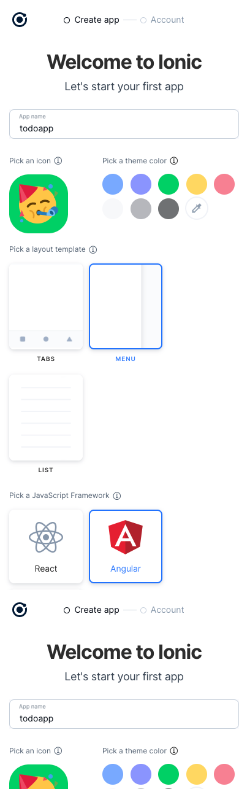

# STUDY.IONIC.TODOAPP

- Ionic とは
  - モバイル、デスクトップアプリを作るフレームワーク
  - Web 技術を利用する
  - Web Components が使われている
  - Angular, React, Vue などを利用できる
  - オリジナルの UI コンポーネントを持っている
  - ルーティング機能もある
  - ページ遷移時のアニメーションもある
  - カメラなどのネイティブ機能にもアクセスできる
- 特徴
  - UI コンポーネントが揃っている
    - iOS, Android を気にしなくて良い
  - 軽量で高速である
    - 本には色々比較が書いてある
    - 今回は特に気にしないでいく
  - モバイルライクな URL ルーティング
    - 非線形ナビゲーション、ナビゲーションスタックを使っている
  - モバイルアプリに変換する機能の標準装備
  - セマンティックバージョニングの採用

## 作業ログ

- Node のバージョンを確認する。v12 以上であればよさそう。

```bash
node -v

v18.7.0
```

- ionic をインストールする。
- 以下の警告が出ている
  - `formidiable@1.2.6` の deprecated 警告
  - `uuid@3.4.0` の deprecated 警告
  - `superagent@4.1.0` の deprecated 警告
  - `ionic@5.4.16` の deprecated 警告
- ionic の CLI は `@ionic/cli` にパッケージ名が変わったらしい。
- twitter を見ろ、とあるので確認してみる。

```bash
npm i -g ionic

npm WARN deprecated formidable@1.2.6: Please upgrade to latest, formidable@v2 or formidable@v3! Check these notes: https://bit.ly/2ZEqIau
npm WARN deprecated uuid@3.4.0: Please upgrade  to version 7 or higher.  Older versions may use Math.random() in certain circumstances, which is known to be problematic.  See https://v8.dev/blog/math-random for details.
npm WARN deprecated superagent@4.1.0: Please upgrade to v7.0.2+ of superagent.  We have fixed numerous issues with streams, form-data, attach(), filesystem errors not bubbling up (ENOENT on attach()), and all tests are now passing.  See the releases tab for more information at <https://github.com/visionmedia/superagent/releases>.
npm WARN deprecated ionic@5.4.16: The Ionic CLI now uses ✨ @ionic/cli ✨ for its package name! 👉 https://twitter.com/ionicframework/status/1223268498362851330

added 233 packages, and audited 234 packages in 12s

21 packages are looking for funding
  run `npm fund` for details

6 vulnerabilities (1 moderate, 4 high, 1 critical)

To address all issues possible (including breaking changes), run:
  npm audit fix --force

Some issues need review, and may require choosing
a different dependency.

Run `npm audit` for details.
```

- `ionic` はアンインストールする

```bash
npm uninstall -g ionic
```

- `@ionic/cli` をインストールする
- 以下の警告が出ている
  - `formidable@1.2.6` の deprecated 警告
  - `superagent@5.3.1` の deprecated 警告
- 今回は上記警告は無視する

```bash
npm i -g @ionic/cli

npm WARN deprecated formidable@1.2.6: Please upgrade to latest, formidable@v2 or formidable@v3! Check these notes: https://bit.ly/2ZEqIau
npm WARN deprecated superagent@5.3.1: Please upgrade to v7.0.2+ of superagent.  We have fixed numerous issues with streams, form-data, attach(), filesystem errors not bubbling up (ENOENT on attach()), and all tests are now passing.  See the releases tab for more information at <https://github.com/visionmedia/superagent/releases>.

added 218 packages, and audited 219 packages in 9s

26 packages are looking for funding
  run `npm fund` for details

found 0 vulnerabilities
```

- `@ionic/cli` のバージョンを確認する。

```bash
ionic -v

6.20.1
```

- `ionic` プロジェクトを作成する。

```bash
ionic start

? Use the app creation wizard? Yes
[INFO] Existing git project found (/Users/koyasaeki/study/study.ionic.todoapp). Git operations are disabled.
✔ Preparing directory ./todoapp in 712.69μs
✔ Downloading and extracting sidemenu starter in 180.43ms
> ionic integrations enable capacitor --quiet -- todoapp io.ionic.starter
> npm i --save -E @capacitor/core@latest
npm WARN deprecated har-validator@5.1.5: this library is no longer supported
npm WARN deprecated uuid@3.4.0: Please upgrade  to version 7 or higher.  Older versions may use Math.random() in certain circumstances, which is known to be problematic.  See https://v8.dev/blog/math-random for details.
npm WARN deprecated request@2.88.2: request has been deprecated, see https://github.com/request/request/issues/3142
npm WARN deprecated protractor@7.0.0: We have news to share - Protractor is deprecated and will reach end-of-life by Summer 2023. To learn more and find out about other options please refer to this post on the Angular blog. Thank you for using and contributing to Protractor. https://goo.gle/state-of-e2e-in-angular

added 1285 packages, and audited 1286 packages in 1m

171 packages are looking for funding
  run `npm fund` for details

found 0 vulnerabilities
> npm i -D -E @capacitor/cli@latest

added 31 packages, and audited 1317 packages in 7s

171 packages are looking for funding
  run `npm fund` for details

found 0 vulnerabilities
> npm i --save -E @capacitor/haptics @capacitor/app @capacitor/keyboard @capacitor/status-bar

added 4 packages, and audited 1321 packages in 6s

171 packages are looking for funding
  run `npm fund` for details

found 0 vulnerabilities
> capacitor init todoapp io.ionic.starter --web-dir www
✔ Creating capacitor.config.ts in /Users/koyasaeki/study/study.ionic.todoapp/todoapp in 2.38ms
[success] capacitor.config.ts created!

Next steps:
https://capacitorjs.com/docs/getting-started#where-to-go-next
[OK] Integration capacitor added!

Installing dependencies may take several minutes.

  ──────────────────────────────────────────────────────────────

        Ionic Appflow, the mobile DevOps solution by Ionic

           Continuously build, deploy, and ship apps 🚀
        Focus on building apps while we automate the rest 🎁

                 👉  https://ion.link/appflow  👈

  ──────────────────────────────────────────────────────────────


> npm i

up to date, audited 1321 packages in 2s

171 packages are looking for funding
  run `npm fund` for details

found 0 vulnerabilities

Your Ionic app is ready! Follow these next steps:

- Go to your new project: cd ./todoapp
- Run ionic serve within the app directory to see your app in the browser
- Run ionic capacitor add to add a native iOS or Android project using Capacitor
- Generate your app icon and splash screens using cordova-res --skip-config --copy
- Explore the Ionic docs for components, tutorials, and more: https://ion.link/docs
- Building an enterprise app? Ionic has Enterprise Support and Features: https://ion.link/enterprise-edition
```

- GUI でプロジェクト設定ができるらしい
- 本に書いてあるオプションに合わせて進める
- ユーザー登録が必要みたいなので GitHub でサインアップする




- `todoapp` ディレクトリが作成されているので、移動して ionic を起動する

```bash
ionic serve

> ng run app:serve --host=localhost --port=8100
[ng] - Generating browser application bundles (phase: setup)...
[ng] ✔ Browser application bundle generation complete.
[ng] Initial Chunk Files                                                                                     | Names                     |  Raw Size
[ng] vendor.js                                                                                               | vendor                    |   3.79 MB |
[ng] polyfills.js                                                                                            | polyfills                 | 355.41 kB |
[ng] styles.css, styles.js                                                                                   | styles                    | 250.24 kB |
[ng] main.js                                                                                                 | main                      |  22.00 kB |
[ng] runtime.js                                                                                              | runtime                   |  14.11 kB |
[ng]
[ng]                                                                                                         | Initial Total             |   4.42 MB
[ng]
[ng] Lazy Chunk Files                                                                                        | Names                     |  Raw Size
[ng] node_modules_ionic_core_dist_esm_swiper_bundle-28080340_js.js                                           | swiper-bundle-28080340-js | 199.26 kB |
[ng] polyfills-core-js.js                                                                                    | polyfills-core-js         | 152.87 kB |
[ng] node_modules_ionic_core_dist_esm_ion-datetime_3_entry_js.js                                             | -                         | 131.75 kB |
[ng] node_modules_ionic_core_dist_esm_ion-item_8_entry_js.js                                                 | -                         |  98.11 kB |
[ng] node_modules_ionic_core_dist_esm_ion-modal_entry_js.js                                                  | -                         |  82.94 kB |
[ng] node_modules_ionic_core_dist_esm_ion-app_8_entry_js.js                                                  | -                         |  82.92 kB |
[ng] node_modules_ionic_core_dist_esm_ion-popover_entry_js.js                                                | -                         |  61.69 kB |
[ng] node_modules_ionic_core_dist_esm_ion-slide_2_entry_js.js                                                | -                         |  60.42 kB |
[ng] node_modules_ionic_core_dist_esm_ion-refresher_2_entry_js.js                                            | -                         |  54.08 kB |
[ng] node_modules_ionic_core_dist_esm_ion-alert_entry_js.js                                                  | -                         |  50.91 kB |
[ng] default-node_modules_ionic_core_dist_esm_parse-26477881_js-node_modules_ionic_core_dist_esm_t-6bed99.js | -                         |  46.31 kB |
[ng] common.js                                                                                               | common                    |  45.50 kB |
[ng] node_modules_ionic_core_dist_esm_ion-segment_2_entry_js.js                                              | -                         |  43.14 kB |
[ng] node_modules_ionic_core_dist_esm_ion-menu_3_entry_js.js                                                 | -                         |  41.60 kB |
[ng] node_modules_ionic_core_dist_esm_ion-item-option_3_entry_js.js                                          | -                         |  38.71 kB |
[ng] node_modules_ionic_core_dist_esm_ion-searchbar_entry_js.js                                              | -                         |  36.62 kB |
[ng] node_modules_ionic_core_dist_esm_ion-range_entry_js.js                                                  | -                         |  36.56 kB |
[ng] node_modules_ionic_core_dist_esm_ion-nav_2_entry_js.js                                                  | -                         |  36.31 kB |
[ng] node_modules_ionic_core_dist_esm_ion-button_2_entry_js.js                                               | -                         |  36.28 kB |
[ng] node_modules_ionic_core_dist_esm_ion-route_4_entry_js.js                                                | -                         |  35.53 kB |
[ng] node_modules_ionic_core_dist_esm_ion-select_3_entry_js.js                                               | -                         |  34.42 kB |
[ng] node_modules_ionic_core_dist_esm_ion-action-sheet_entry_js.js                                           | -                         |  32.93 kB |
[ng] node_modules_ionic_core_dist_esm_ion-fab_3_entry_js.js                                                  | -                         |  30.26 kB |
[ng] node_modules_ionic_core_dist_esm_ion-accordion_2_entry_js.js                                            | -                         |  27.37 kB |
[ng] polyfills-dom.js                                                                                        | polyfills-dom             |  26.82 kB |
[ng] node_modules_ionic_core_dist_esm_ion-tab-bar_2_entry_js.js                                              | -                         |  26.54 kB |
[ng] node_modules_ionic_core_dist_esm_ion-toast_entry_js.js                                                  | -                         |  26.07 kB |
[ng] node_modules_ionic_core_dist_esm_ion-input_entry_js.js                                                  | -                         |  25.29 kB |
[ng] node_modules_ionic_core_dist_esm_ion-breadcrumb_2_entry_js.js                                           | -                         |  25.22 kB |
[ng] node_modules_ionic_core_dist_esm_ion-progress-bar_entry_js.js                                           | -                         |  24.59 kB |
[ng] node_modules_ionic_core_dist_esm_ion-toggle_entry_js.js                                                 | -                         |  22.89 kB |
[ng] node_modules_ionic_core_dist_esm_ion-textarea_entry_js.js                                               | -                         |  22.64 kB |
[ng] node_modules_ionic_core_dist_esm_ion-picker-internal_entry_js.js                                        | -                         |  22.06 kB |
[ng] node_modules_ionic_core_dist_esm_ion-picker-column-internal_entry_js.js                                 | -                         |  20.69 kB |
[ng] node_modules_ionic_core_dist_esm_ion-back-button_entry_js.js                                            | -                         |  19.72 kB |
[ng] node_modules_ionic_core_dist_esm_ion-radio_2_entry_js.js                                                | -                         |  19.44 kB |
[ng] node_modules_ionic_core_dist_esm_ion-virtual-scroll_entry_js.js                                         | -                         |  19.41 kB |
[ng] node_modules_ionic_core_dist_esm_ion-card_5_entry_js.js                                                 | -                         |  18.14 kB |
[ng] node_modules_ionic_core_dist_esm_ion-datetime-button_entry_js.js                                        | -                         |  18.04 kB |
[ng] node_modules_ionic_core_dist_esm_ion-loading_entry_js.js                                                | -                         |  17.69 kB |
[ng] node_modules_ionic_core_dist_esm_input-shims-a9a56f5a_js.js                                             | input-shims-a9a56f5a-js   |  17.60 kB |
[ng] node_modules_ionic_core_dist_esm_ion-infinite-scroll_2_entry_js.js                                      | -                         |  16.00 kB |
[ng] node_modules_ionic_core_dist_esm_ion-col_3_entry_js.js                                                  | -                         |  15.72 kB |
[ng] node_modules_ionic_core_dist_esm_ion-reorder_2_entry_js.js                                              | -                         |  15.14 kB |
[ng] node_modules_ionic_core_dist_esm_ion-checkbox_entry_js.js                                               | -                         |  14.14 kB |
[ng] node_modules_ionic_core_dist_esm_ion-chip_entry_js.js                                                   | -                         |  12.29 kB |
[ng] node_modules_ionic_core_dist_esm_ion-spinner_entry_js.js                                                | -                         |  10.66 kB |
[ng] node_modules_ionic_core_dist_esm_ion-split-pane_entry_js.js                                             | -                         |  10.15 kB |
[ng] node_modules_ionic_core_dist_esm_ion-tab_2_entry_js.js                                                  | -                         |   9.86 kB |
[ng] node_modules_ionic_core_dist_esm_ion-avatar_3_entry_js.js                                               | -                         |   8.26 kB |
[ng] src_app_folder_folder_module_ts.js                                                                      | folder-folder-module      |   7.74 kB |
[ng] node_modules_ionic_core_dist_esm_ion-ripple-effect_entry_js.js                                          | -                         |   6.67 kB |
[ng] node_modules_ionic_core_dist_esm_index-595c1526_js.js                                                   | index-595c1526-js         |   6.31 kB |
[ng] node_modules_ionic_core_dist_esm_ion-img_entry_js.js                                                    | -                         |   4.54 kB |
[ng] node_modules_ionic_core_dist_esm_ion-text_entry_js.js                                                   | -                         |   4.19 kB |
[ng] node_modules_ionic_core_dist_esm_ion-backdrop_entry_js.js                                               | -                         |   3.49 kB |
[ng] node_modules_ionic_core_dist_esm_status-tap-6e5168a1_js.js                                              | status-tap-6e5168a1-js    |   2.93 kB |
[ng]
[ng] Build at: 2022-08-26T06:29:35.966Z - Hash: 44662e2b99ca234c - Time: 14891ms
[ng] ✔ Compiled successfully.

[INFO] Development server running!

       Local: http://localhost:8100

       Use Ctrl+C to quit this process

[INFO] Browser window opened to http://localhost:8100!
```

- ブラウザでアプリが起動する


